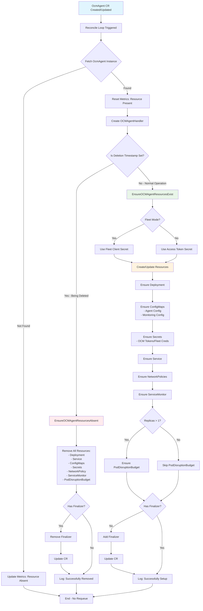
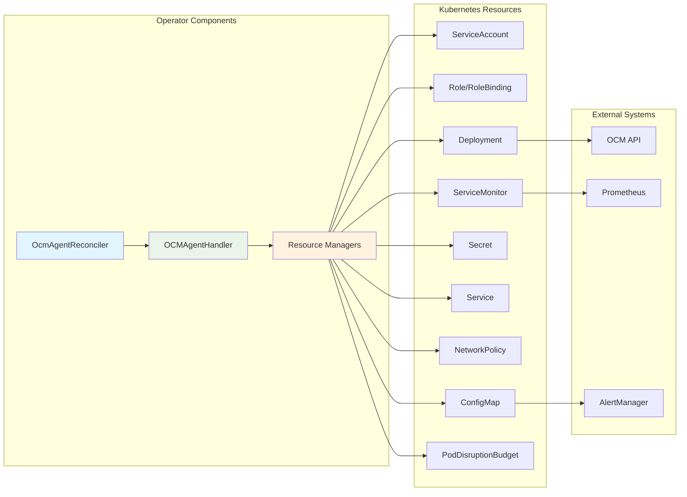
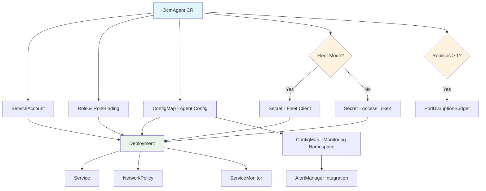

# OCM Agent Operator Flowchart

```mermaid
flowchart TD
    A[OcmAgent CR Created/Updated] --> B[Reconcile Loop Triggered]

    B --> C{Fetch OcmAgent Instance}
    C -->|Not Found| D[Update Metrics: Resource Absent]
    D --> E[End - No Requeue]

    C -->|Found| F[Reset Metrics: Resource Present]
    F --> G[Create OCMAgentHandler]

    G --> H{Is Deletion Timestamp Set?}

    H -->|Yes - Being Deleted| I[EnsureOCMAgentResourcesAbsent]
    I --> J[Remove All Resources:<br/>- Deployment<br/>- Service<br/>- ConfigMaps<br/>- Secrets<br/>- NetworkPolicy<br/>- ServiceMonitor<br/>- PodDisruptionBudget]
    J --> K{Has Finalizer?}
    K -->|Yes| L[Remove Finalizer]
    L --> M[Update CR]
    M --> N[Log: Successfully Removed]
    K -->|No| N
    N --> E

    H -->|No - Normal Operation| O[EnsureOCMAgentResourcesExist]
    O --> P{Fleet Mode?}
    P -->|Yes| Q[Use Fleet Client Secret]
    P -->|No| R[Use Access Token Secret]

    Q --> S[Create/Update Resources]
    R --> S

    S --> T[Ensure Deployment]
    T --> U[Ensure ConfigMaps<br/>- Agent Config<br/>- Monitoring Config]
    U --> V[Ensure Secrets<br/>- OCM Tokens/Fleet Creds]
    V --> W[Ensure Service]
    W --> X[Ensure NetworkPolicies]
    X --> Y[Ensure ServiceMonitor]
    Y --> Z{Replicas > 1?}
    Z -->|Yes| AA[Ensure PodDisruptionBudget]
    Z -->|No| BB[Skip PodDisruptionBudget]
    AA --> CC{Has Finalizer?}
    BB --> CC

    CC -->|No| DD[Add Finalizer]
    DD --> EE[Update CR]
    EE --> FF[Log: Successfully Setup]
    CC -->|Yes| FF
    FF --> E

    style A fill:#e1f5fe
    style I fill:#ffebee
    style O fill:#e8f5e8
    style S fill:#fff3e0
```

## Key Components Flow

```mermaid
flowchart LR
    subgraph "Operator Components"
        A[OcmAgentReconciler] --> B[OCMAgentHandler]
        B --> C[Resource Managers]
    end

    subgraph "Kubernetes Resources"
        D[ServiceAccount]
        E[Role/RoleBinding]
        F[Deployment]
        G[ConfigMap]
        H[Secret]
        I[Service]
        J[NetworkPolicy]
        K[ServiceMonitor]
        L[PodDisruptionBudget]
    end

    subgraph "External Systems"
        M[OCM API]
        N[Prometheus]
        O[AlertManager]
    end

    C --> D
    C --> E
    C --> F
    C --> G
    C --> H
    C --> I
    C --> J
    C --> K
    C --> L

    F --> M
    K --> N
    G --> O

    style A fill:#e1f5fe
    style B fill:#e8f5e8
    style C fill:#fff3e0
```

## Resource Dependencies

```mermaid
flowchart TD
    A[OcmAgent CR] --> B[ServiceAccount]
    A --> C[Role & RoleBinding]
    A --> D[ConfigMap - Agent Config]
    A --> E{Fleet Mode?}

    E -->|Yes| F[Secret - Fleet Client]
    E -->|No| G[Secret - Access Token]

    B --> H[Deployment]
    C --> H
    D --> H
    F --> H
    G --> H

    H --> I[Service]
    H --> J[NetworkPolicy]
    H --> K[ServiceMonitor]

    A --> L{Replicas > 1?}
    L -->|Yes| M[PodDisruptionBudget]

    D --> N[ConfigMap - Monitoring Namespace]
    N --> O[AlertManager Integration]

    style A fill:#e1f5fe
    style H fill:#e8f5e8
    style E fill:#fff3e0
    style L fill:#fff3e0
```